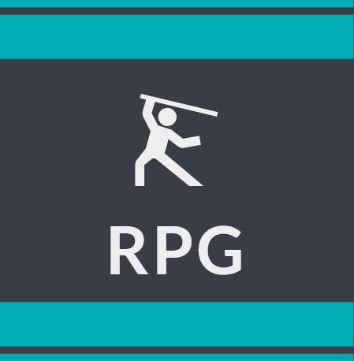
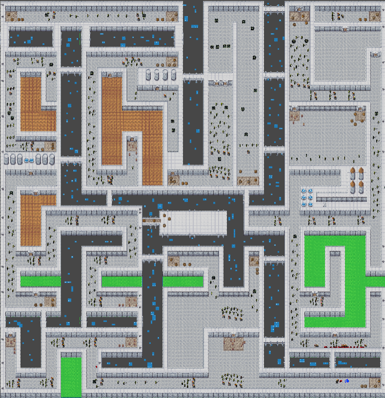
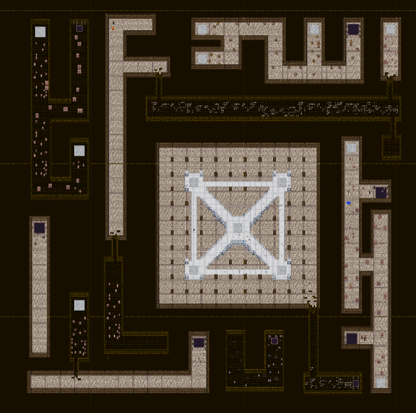
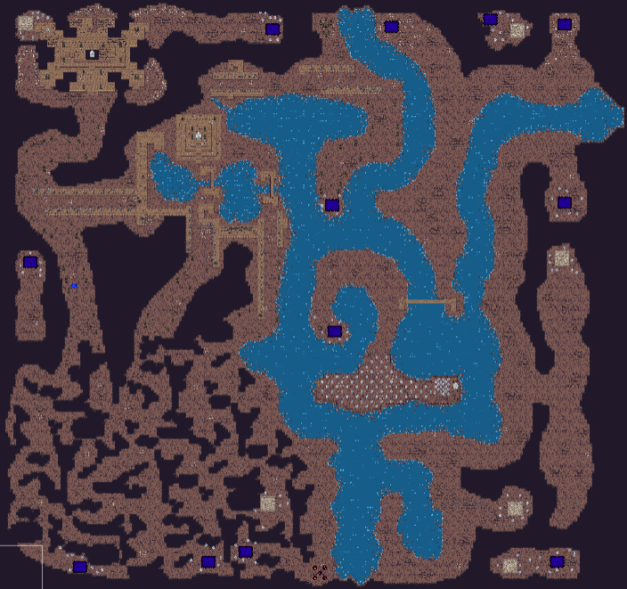
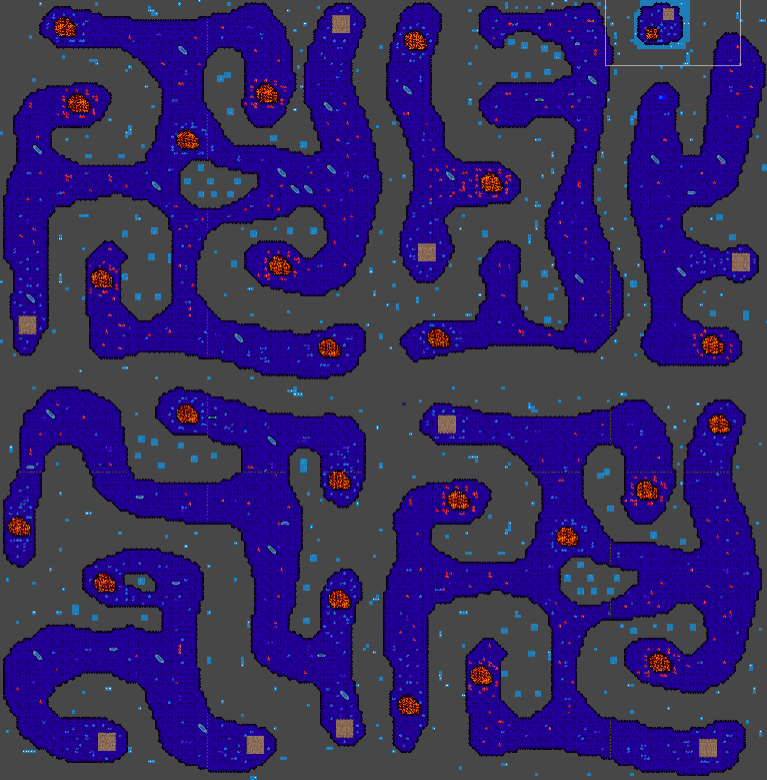
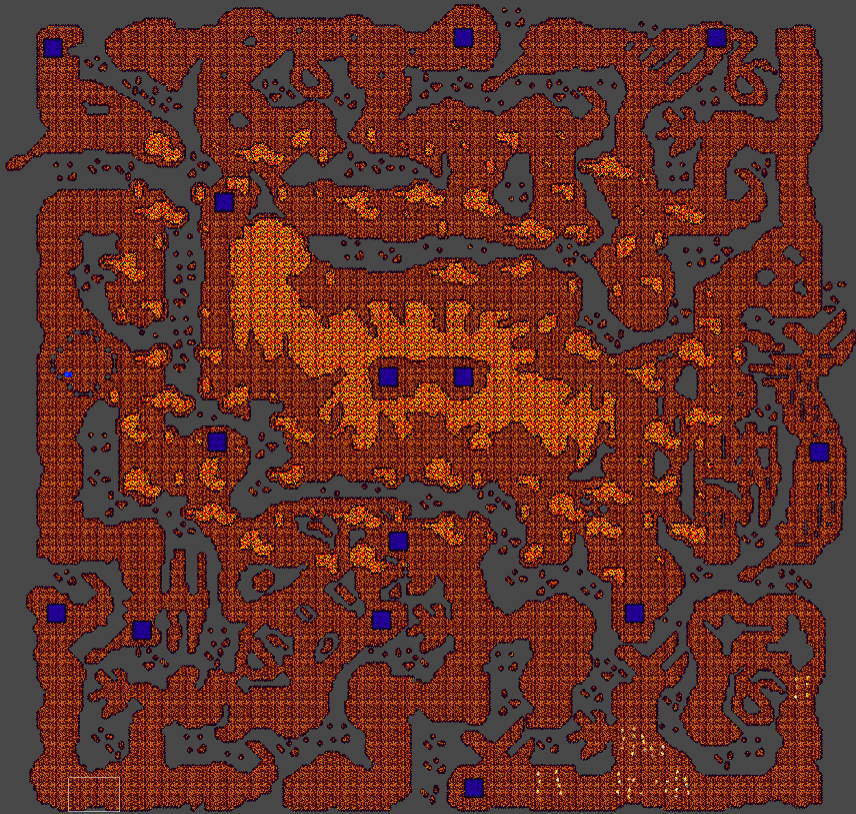

<div id="top"></div>

[![Contributors][contributors-shield]][contributors-url] [![Forks][forks-shield]][forks-url] [![Stargazers][stars-shield]][stars-url] [![Issues][issues-shield]][issues-url] [![MIT License][license-shield]][license-url]


<!-- PROJECT LOGO -->
<br />
<div align="center">
  <a href="https://github.com/othneildrew/Best-README-Template">
    
  </a>

  <h3 align="center">RPG</h3>

  <p align="center">
	A 2D open world game from players for players
    <br />
    <a href="https://github.com/othneildrew/Best-README-Template">
    <br />
    <br />
    <a href="https://www.youtube.com/watch?v=RGfC35omRbY&list=PLzLykJmDCNQ-ni7Ptrsy7ai3n6y2dx4ak&index=1">View Demo</a>
    ·
    <a href="https://github.com/dg1asap/RPG/issues">Report Bug</a>
    ·
    <a href="https://github.com/dg1asap/RPG/issues">Request Feature</a>
  </p>
</div>


<!-- TABLE OF CONTENTS -->
<details>
  <summary>Table of Contents</summary>
  <ol>
    <li>
      <a href="#about-the-project">About The Project</a>
      <ul>
        <li><a href="#built-with">Built With</a></li>
      </ul>
    </li>
    <li>
      <a href="#getting-started">Getting Started</a>
      <ul>
        <li><a href="#prerequisites">Prerequisites</a></li>
        <li><a href="#installation">Installation</a></li>
      </ul>
    </li>
    <li><a href="#usage">World Map</a></li>
    <li><a href="#roadmap">Roadmap</a></li>
    <li><a href="#contributing">Contributing</a></li>
    <li><a href="#license">License</a></li>
    <li><a href="#contact">Contact</a></li>
    <li><a href="#acknowledgments">Acknowledgments</a></li>
  </ol>
</details>


<!-- ABOUT THE PROJECT -->
## About The Project


The RPG is the work of two buddies who want to create their own open-world game, full of exploration, on their own terms. RPG is a game without a main storyline, based on fighting with monsters and discovering new corners of the map. The game is played from the top-down perspective and the main type of weapon is the throwing weapon and shield.

<p align="right">(<a href="#top">back to top</a>)</p>


### Built With

* [Unity](https://unity.com)
* [C#](https://docs.microsoft.com/en-us/dotnet/csharp/)


<p align="right">(<a href="#top">back to top</a>)</p>


<!-- GETTING STARTED -->
## Getting Started

### Prerequisites

Download and install the software below
* [Unity and Unity Hub](https://unity3d.com/get-unity/download)
* [.NET](https://dotnet.microsoft.com/en-us/download)

If you want to install .NET on Linux, I recommend the [site](https://docs.microsoft.com/en-us/dotnet/core/install/linux)

### Installation

1. Clone the repo
   ```sh
   https://github.com/dg1asap/RPG.git
   ```
2. Open project using Unity Hub, follow [instruction](https://docs.unity3d.com/2018.2/Documentation/Manual/GettingStartedOpeningProjects.html)


<p align="right">(<a href="#top">back to top</a>)</p>


<!-- USAGE EXAMPLES -->
## World Map

#### Five-story maze

* ##### Castle
    
* ##### Dungeon
    
* ##### Catacombs
    
* ##### Crystal cave
    
* ##### Hell
    

<p align="right">(<a href="#top">back to top</a>)</p>


<!-- ROADMAP -->
## Roadmap

- [x] Spawn point
- [x] Power up's (regeneration heart's) and Coin's
- [x] New mob's: Goblins, Demons, Robots, Bugs, Eye, BOSS, Slime, Killer
- [x] Maze map
- [x] Add the most epic easter eggs ever
- [x] New weapon's: shield, magic
- [ ] Optimalisation of enemy dmg, hp, speed
- [ ] Android version

<p align="right">(<a href="#top">back to top</a>)</p>


<!-- CONTRIBUTING -->
## Contributing

Contributions are what make the open source community such an amazing place to learn, inspire, and create. Any contributions you make are **greatly appreciated**.

If you have a suggestion that would make this better, please fork the repo and create a pull request. You can also simply open an issue with the tag "enhancement".
Don't forget to give the project a star! Thanks again!

1. Fork the Project
2. Create your Feature Branch (`git checkout -b feature/AmazingFeature`)
3. Commit your Changes (`git commit -m 'Add some AmazingFeature'`)
4. Push to the Branch (`git push origin feature/AmazingFeature`)
5. Open a Pull Request

<p align="right">(<a href="#top">back to top</a>)</p>


<!-- LICENSE -->
## License

Distributed under the MIT License. See `LICENSE.txt` for more information.

<p align="right">(<a href="#top">back to top</a>)</p>


<!-- CONTACT -->
## Contact

dg1asap - dg_1@wp.pl

kuba173 - j.kiernozek173@wp.pl

Project Link: [https://github.com/dg1asap/RPG](https://github.com/dg1asap/RPG)


<p align="right">(<a href="#top">back to top</a>)</p>


<!-- ACKNOWLEDGMENTS -->
## Acknowledgments

* [Img Shields](https://shields.io)

<p align="right">(<a href="#top">back to top</a>)</p>


<!-- MARKDOWN LINKS & IMAGES -->
<!-- https://www.markdownguide.org/basic-syntax/#reference-style-links -->
[contributors-shield]: https://img.shields.io/github/contributors/dg1asap/RPG.svg?style=for-the-badge
[contributors-url]: https://github.com/dg1asap/RPG/graphs/contributors
[forks-shield]: https://img.shields.io/github/forks/dg1asap/RPG.svg?style=for-the-badge
[forks-url]: https://github.com/dg1asap/RPG/network/members
[stars-shield]: https://img.shields.io/github/stars/dg1asap/RPG.svg?style=for-the-badge
[stars-url]: https://github.com/dg1asap/RPG/stargazers
[issues-shield]: https://img.shields.io/github/issues/dg1asap/RPG.svg?style=for-the-badge
[issues-url]: https://github.com/dg1asap/RPG/issues
[license-shield]: https://img.shields.io/github/license/dg1asap/RPG.svg?style=for-the-badge
[license-url]: https://github.com/dg1asap/RPG/blob/master/LICENSE.txt
